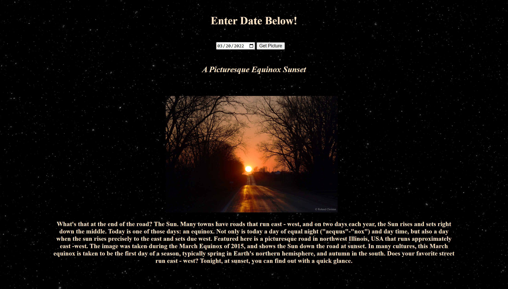

# 🚀 Project: Simple NASA API

### Goal: Enable your user to enter a date and return the picture/video of the day from NASA's API.

## NASA 'A Picture of the Day' project allows users to enter any previous date (or today's date) to receive NASA's picture of the day, with a description of the picture received. 

*Project completed using HTML, CSS, and Javascript.*



<!-- ### How to submit your code for review:

- Fork and clone this repo
- Create a new branch called answer
- Checkout answer branch
- Push to your fork
- Issue a pull request
- Your pull request description should contain the following:
  - (1 to 5 no 3) I completed the challenge
  - (1 to 5 no 3) I feel good about my code
  - Anything specific on which you want feedback!

Example:
```
I completed the challenge: 5
I feel good about my code: 4
I'm not sure if my constructors are setup cleanly...
``` -->
